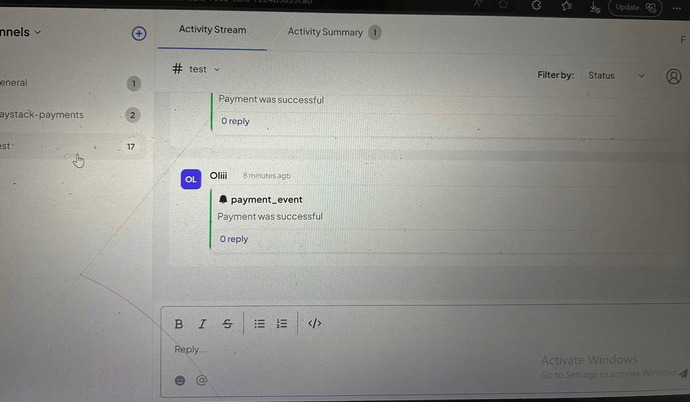

# Payment Integration API

## Overview

This is an Express app that simulates Paystack's payment processing and sends results to a specified return URL. It uses mock payment data and processes each event in sequence.

### Features

- Sequential Payment Data: Sends mock payment event data sequentially (payment success, failure, cashback).

- Webhook Integration: Sends data to a given return_url using a POST request.

- Error Handling: Logs and handles errors when sending requests to the return URL.

## Setup

### Prerequisites

- Node.js (v14+)
- TypeScript

### Install Dependencies

```bash
npm install
```

### Installation

**Clone the Repository:**

- git clone https://github.com/Oliver2929/Paystack-TelexPayment.git

- cd Payment Integration

**Run Application:**

- npm run start

## Example Payload

- Here’s an example of the payload you can send in a POST request to the service:

{
"channel_id": <Designated channel id>,
"return_url": <Specified return url>,
"settings": [
{
"label": "telex-channel",
"type": "text",
"required": true,
"default": "transaction-alerts"
}
]
}

## Screenshot of response

- 

- 
